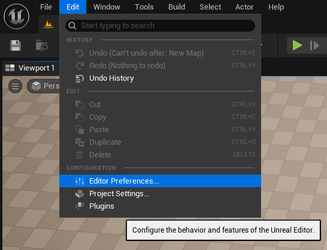
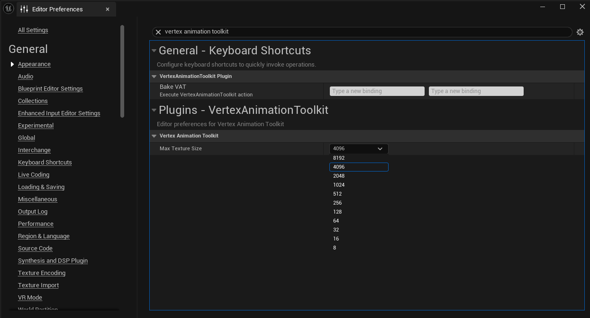
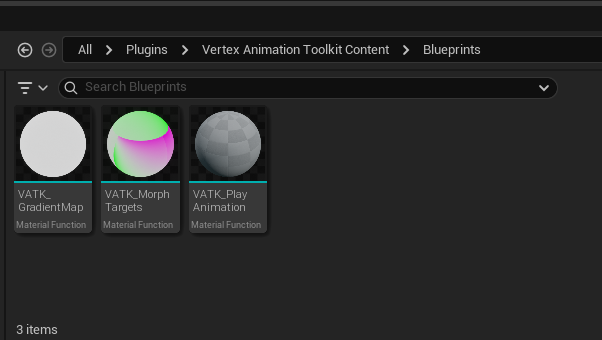
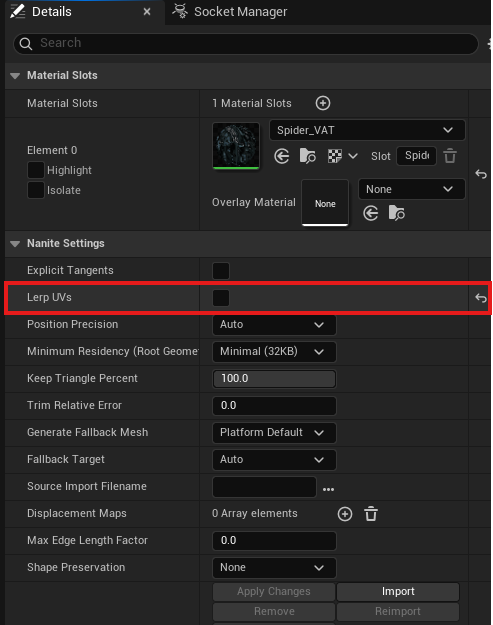

# Using VAT in UEFN

Vertex Animation Toolkit is an Unreal Engine editor plugin, and UEFN does not load
custom plugins. You can still use vertex animation textures in your Fortnite island:
bake them in Unreal Engine 5, then copy the generated assets and the plugin's material
functions into your UEFN project.

This page walks through the full process.

## 1. Set Max Texture Size to 4096

UEFN does not support the plugin's default texture size of **8192**, so lower the
limit before you bake.

1. In Unreal Engine 5, open **Edit → Editor Preferences**.

   

2. Search for **vertex animation toolkit**, then set **Max Texture Size** to **4096**.

   

::: tip
Meshes with more than 4096 vertices or animations with more than 4096 frames are
automatically split into multiple texture-array slices, so 4096 does not limit what you
can bake. See [Max Texture Size](../get_started/05-max_texture_size.md).
:::

## 2. Copy the material functions to UEFN

The plugin's runtime material functions need to exist in your UEFN project. In the
Content Browser, open **Plugins → Vertex Animation Toolkit Content → Blueprints** and
copy these three material functions into your UEFN project:

- **VATK_PlayAnimation**
- **VATK_MorphTargets**
- **VATK_GradientMap**

Select all three, right-click and choose **Asset Actions → Migrate...**, then pick the
**Content** folder of your UEFN project as the destination.

::: tip
Copy all three functions together. **VATK_PlayAnimation** calls **VATK_MorphTargets**,
which in turn calls **VATK_GradientMap**. If any function call shows up as unset after
copying, open the function and reassign it.
:::

## 3. Bake the VAT in Unreal Engine 5

Bake the animation in Unreal Engine 5 as usual, see [Generate Textures](../get_started/02-generate_textures.md).
Then copy the four generated assets to your UEFN project the same way as in step 2:

- the **Static Mesh**
- the **Positions** texture array
- the **Normals** texture array
- the **Play Helper** material function

## 4. Disable Lerp UVs on the static mesh

In UEFN, open the copied static mesh. Under **Nanite Settings**, uncheck **Lerp UVs** and
click **Apply Changes**.

::: warning
This step is required. The toolkit stores each vertex's texture location in UV channel 1.
When **Lerp UVs** is enabled, Nanite interpolates these values while building the mesh,
which breaks the animation lookup in the material.
:::

## 5. Set up the material

Create the material in UEFN the same way as in Unreal Engine 5, see [Material Setup](../get_started/03-material_setup.md).
Use the material functions you copied in step 2 and the textures and Play Helper from step 3, and assign the material to the static mesh.

## 6. Use it in Scene Graph

The baked asset is a regular static mesh, so it can be placed like any other mesh.
In **Scene Graph**, add a **Mesh** component to your entity and set its mesh to the baked
static mesh. The animation plays entirely inside the material, so no additional runtime
setup is needed.

::: tip
The [Runtime](../get_started/04-runtime.md) helpers (Vertex Animation Subsystem, ISM /
HISM components and the Vertex Animation Instance component) are part of the plugin and
are not available in UEFN. Use the static mesh directly instead.
:::
